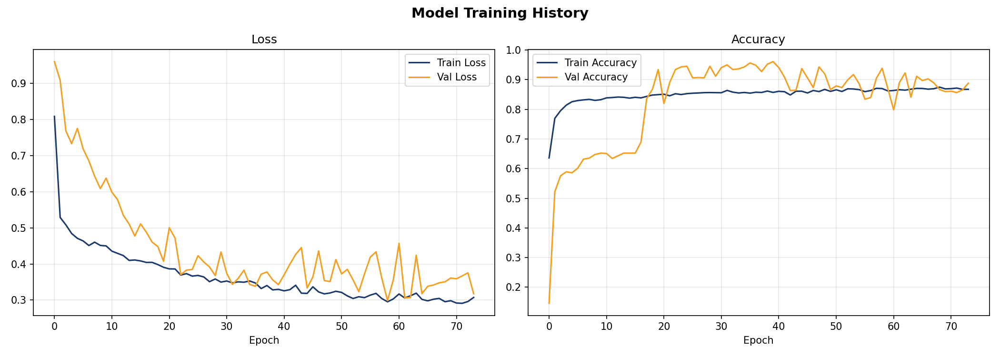
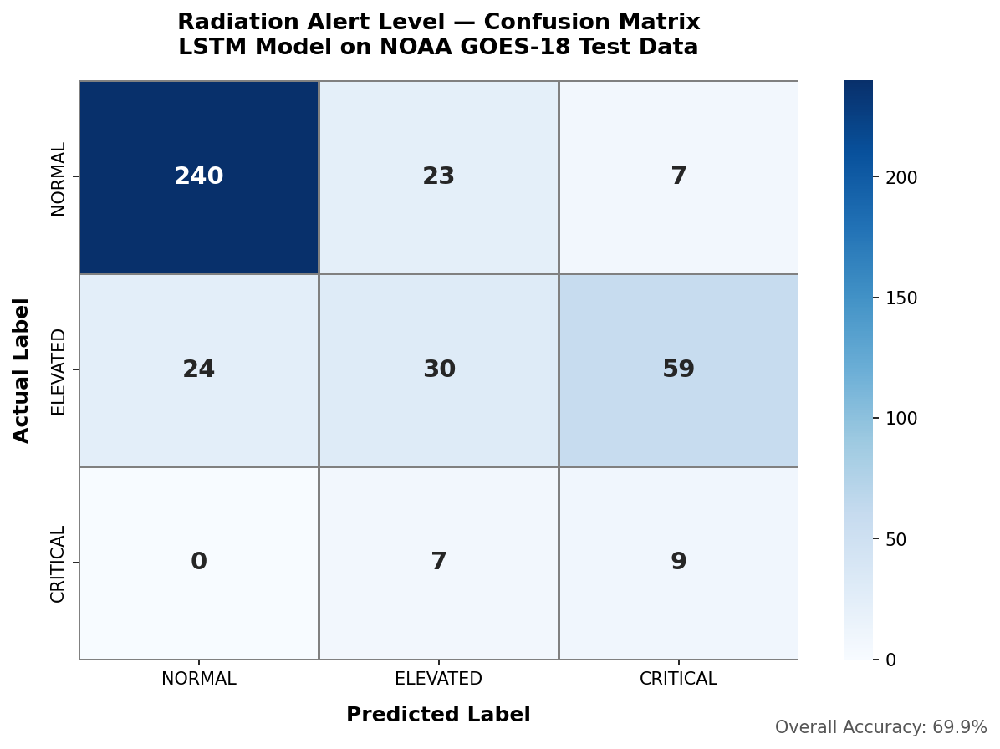
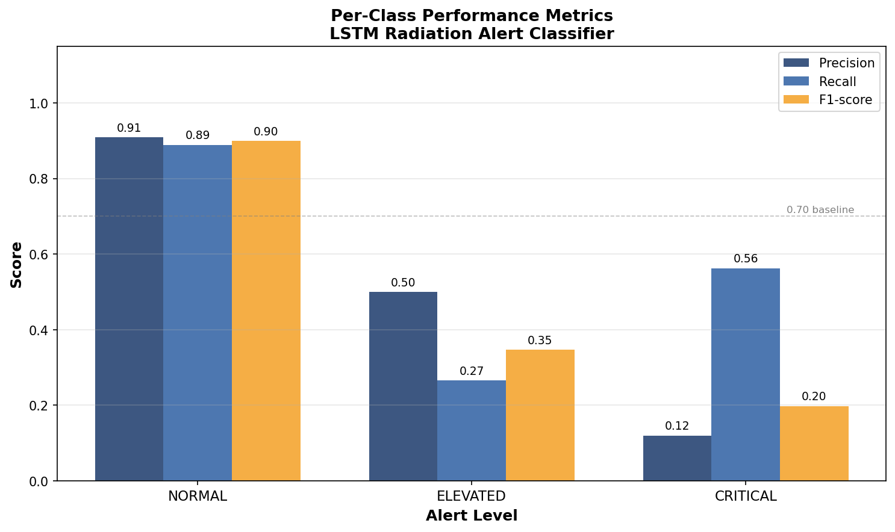
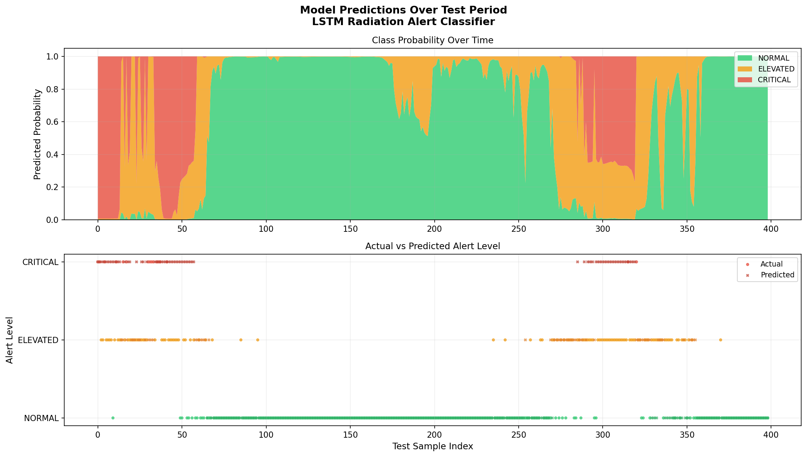

# Radiation Defense Protection System (RDPS)

Undergraduate Capstone Project — Engineering Management / Industrial Engineering

## Overview
A prototype fault-tolerant radiation detection and response system combining real hardware sensing with machine learning-based spike prediction. The system models the architecture of a spacecraft radiation defense layer using accessible hardware and open-source tools.

## Hardware
- Arduino Mega 2560 (Elegoo EL-KIT-008)
- DFRobot Gravity Geiger Counter Module (SEN0463)
- Raspberry Pi 4 Model B 2GB
- PiSugar2 Plus 5000mAh UPS Battery

## ML Model
- Dataset: NOAA GOES-18 proton flux, solar wind, Kp index
- Model: 2-layer LSTM (30,659 parameters)
- Training: SMOTE-balanced (4,455 samples)
- Deployment: TensorFlow Lite (33.6KB) on Raspberry Pi
- CRITICAL recall: 56% — model never misclassifies CRITICAL as NORMAL

## Model Evaluation

### Training History


### Confusion Matrix


### Per-Class Performance


### Predictions Over Time


## Project Status
- [x] Phase 1 — Planning and Setup
- [x] Phase 2 — ML Data Pipeline and Model Training
- [ ] Phase 3 — Arduino and Hardware Integration
- [ ] Phase 4 — Pi Setup and TFLite Deployment
- [ ] Phase 5 — System Logic and Failover
- [ ] Phase 6 — Polish and Documentation

## Repository Structure
```
radiation-defense-system/
├── ml/
│   ├── notebooks/       # Jupyter notebooks (EDA, features, training, eval)
│   └── data/models/     # Trained model, scaler, evaluation charts
├── docs/                # Project spec, Gantt chart
└── README.md
```

## References
- NASA RadPC: https://www.nasa.gov/missions/artemis/nasa-to-test-solution-for-radiation-tolerant-computing-in-space
- NOAA GOES-18: https://services.swpc.noaa.gov
- DFRobot SEN0463: https://wiki.dfrobot.com/SKU_SEN0463
- ML in Radiation Oncology (PMC8295850): https://pmc.ncbi.nlm.nih.gov/articles/PMC8295850

## License
MIT
